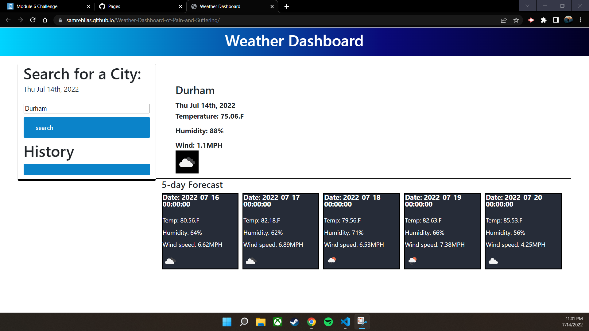

# Requirements

## The user is given a weather dashboard with form inputs

## when the user searches for a city the current and future forecast is displayed

## the user is presented with the city name, the date, and an icon representing weather conditions, temp, humidity, and wind speed.

## The user is presented with a five day forecest displaying the date, an icon, the temperatue, the wind speed, and humidity

deployable link - https://samrebilas.github.io/Weather-Dashboard-of-Pain-and-Suffering/

Live screenshot - 

GitHub url - https://github.com/SamRebilas/Weather-Dashboard-of-Pain-and-Suffering